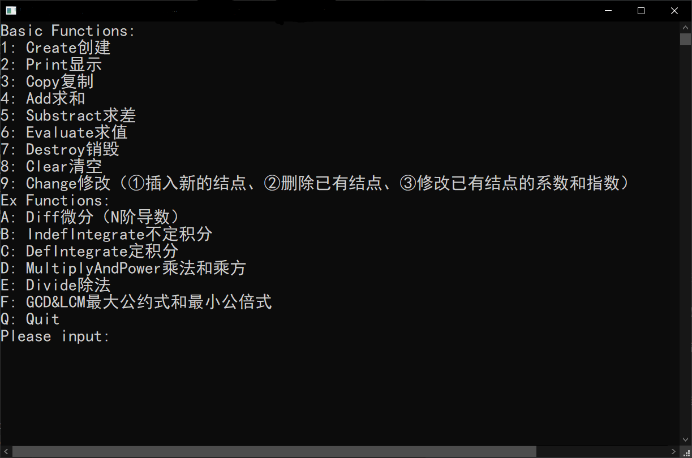

# 线性表的应用：稀疏一元多项式运算器

## 1.  问题的描述

用链式存储结构实现一元多项式的运算。

利用菜单进行功能选择。

1. 创建初始多项式；
2. 显示多项式
3. 复制多项式
4. 计算两多项式之和
5. 计算两多项式差
6. 计算多项式的值
7. 销毁多项式，在其余测试结束后进行检验
8. 清空多项式，在销毁结束后进行检验
9. 修改多项式（增加，删除，改变多项式）
10. 对多项式微分
11. 对多项式不定积分
12. 对多项式定积分
13. 乘法和乘方 
14. 多项式除法
15. 求最大公约式和最小公倍式

## 2. 算法的描述

1. 数据结构的描述

   逻辑结构和存储结构（存储类型定义、对主要变量和数组的说明）。

   数据结构（链表）

   ```C
   typedef struct Term {
   	double coef;
   	// 系数(头结点为多项式项数)
   	int expn;
   	// 指数
   	struct Term *next;
   }Term, *Polynomial;
   // 链表存储多项式
   Polynomial *PolynArray;
   unsigned ArraySize;
   unsigned PolynNum = 0;
   ```

2. 程序结构的描述

   函数原型、功能和接口的描述。

   ```C++
   Status CreatePolyn(Polynomial &P, unsigned m);
   // 1. 创建
   Status PrintPolyn(Polynomial P);
   // 2. 显示
   Status CopyPolyn(Polynomial &Pa, Polynomial Pb);
   // 3. 复制
   Status AddPolyn(Polynomial &Pa, Polynomial Pb);
   // 4. 求和
   Status SubtractPolyn(Polynomial &Pa, Polynomial &Pb);
   // 5. 求差
   Status EvaluatePolyn(Polynomial P, double x, double &result);
   // 6. 求值
   Status DestroyPolyn(Polynomial &P);
   // 7. 销毁
   Status ClearPolyn(Polynomial &P);
   // 8. 清空
   Status InsertTerm(Polynomial &P, double coef, int expn);
   Status DeleteTerm(Polynomial &P, int expn);
   Status ChangeTerm(Polynomial &P, unsigned index, double coef, int expn);
   // 9. 修改（①插入新的结点、②删除已有结点、③修改已有结点的系数和指数）
   
   
   Status DiffPolyn(Polynomial &P, unsigned order);
   // 10. 微分（N阶导数）
   Status IndefIntegratePolyn(Polynomial &P);
   // 11. 不定积分
   Status DefIntegratePolyn(Polynomial &P, double LowerLimit, double UpperLimit, double &result);
   // 12. 定积分
   Status MultiplyPolyn(Polynomial &Pa, Polynomial Pb);
   Status PowerPolyn(Polynomial &P, unsigned index);
   // 13. 乘法和乘方
   Status DividePolyn(Polynomial &Pa, Polynomial Pb, Polynomial &Remainder);
   // 14. 除法
   Status GCDPolyn(Polynomial &Pa, Polynomial Pb);
   Status LCMPolyn(Polynomial &Pa, Polynomial Pb);
   // 15. 最大公约式和最小公倍式
   ```

   1. 多项式创建、清空、插入项、删除项
      链表基本操作，此处略。
   
   2. 多项式求值、定积分
      代入x即可。定积分即先计算每一项定积分然后求和。
   
   3. 多项式相加、相减
      由于多项式此时已按指数从大到小排序，只需将多项式B中每一项插入多项式A；若相等则进行相加，系数为零则删除该项；若其中一者到达尾部，则另一者插入直到也到链表尾部。
      相减只需要将后者的系数全部取负然后相加，注意相减后要将系数还原。
   
   4. 多项式相乘、乘方
      每一项与另一个多项式相乘后相加。由于不存在系数为零的可能，不用考虑相乘后系数为零然后删除项的情况。
      乘方调用多项式乘法。
   
   5. 多项式不定积分、导数
      主要注意系数的修改，以及求导时常数项要删去。对于多次积分/求导，采用循环处理。
   
   6. 多项式带余除法
   
      用除式减被除式，直至被除式最高次指数小于除式。
   
   7. 多项式最大公约式、最小公倍式
      最大公约式采用辗转相除法。
      最小公倍式采用两式相乘，然后除以最大公约式的方法。
   
   

## 3.调试分析

测试数据的选择，程序调试中遇到的问题及解决方法。

测试数据：

> 初始多项式：$X^3+3X^2+2X+6$、$X^3-X^2+2X-2$
> 输入$X^3-X^2+2X-2$时，按$X^3、-X^2、+2X、-2$顺序输入 和 按$-2、X^3、-X^2、+2X$顺序输入
>
> 复制多项式：$X^3+3X^2+2X+6$
>
> 和：$2X^3+2X^2+4X+4$
>
> 差：$4X^2+8$
>
> 值：$x=1，X^3+3X^2+2X+6=12、X^3-X^2+2X+2=4$
>
> 修改：$X^3+3X^2+2X+6$，增加一项$X^4$删除$2X$，并将$3X^2$变为$4X^2$
>
> 微分：$N=1 ：X^3+3X^2+2X+6 \rightarrow 3X^2+6X+2$
>
> 不定积分：$\int X^{3}+3 X^{2}+2 X+6 d X=\frac{24 X+4 X^{2}+4 X^{3}+X^{4}}{4}$
>
> 定积分：$\int_{0}^{1} X^{3}+3 X^{2}+2 X+6 d X=8.25$、$\int_{5}^{5}{X^3+3X^2+2X+6}dx = 0$
>
> 乘法和乘方：
> 乘法：$(X^3+3X^2+2X+6) * (X^3-X^2+2X-2) = X^6+2X^5+X^4+8X^3-8X^2+8X-12$
> 乘方：$(X^2+1)^3 = X^6+3X^4+3X^2+1、(X^2+1)^0=1$
>
> 除法：$(X^3+3X^2+2X+6)/(X^2+1) = X+3（商）\cdots\cdots X+3（余数）$
>
> 最大公约式和最小公倍式：$f(x)=x^{3}+3 x^{2}+2 x+6, g(x)=x^{3}-x^{2}+2 x-2$
> 最大公约式：$(f(x), g(x))=x^{2}+2$
> 最小公倍式：$q({x})=X^{4}+2 X^{3}-X^{2}+4X-6$

程序正常运行，没有发现问题

## 4.算法的时空分析

创建：$O(n^2)$

复制：$O(n)$

求和：$O(n^2)$

求差：$O(n^2)$

求值：$O(n)$

微分：$O(n)$

积分：$O(n)$

乘法和乘方：$O(n^2)$

## 5.测试结果及分析

列出测试数据和测试结果，给出分析和说明。

### 初始界面



创建多项式

$X^3+3X^2+2X+6$

> Please input:`1`
> Input Num of Term:`4`
> Input coef & expn:`1 3 3 2 2 1 6 0`
>
> X^3+3X^2+2X+6
> 请按任意键继续. . .

显示

> Please input:`2`
> 0:
> X^3+3X^2+2X+6
>
> 请按任意键继续. . .

复制

> Please input:`3`
> 0:
> X^3+3X^2+2X+6
>
>
> Input Index of Polynomial(start with 0):`0`
>
> X^3+3X^2+2X+6
> 请按任意键继续. . .

求和

> Please input:`4`
> 0:
> X^3+3X^2+2X+6
>
> 1:
> X^3+3X^2+2X+6
>
>
> Input Index of Polynomial A & B(start with 0):`0 1`
>
> 2X^3+6X^2+4X+12
> 请按任意键继续. . .

求差

> Please input:`5`
> 0:
> 2X^3+6X^2+4X+12
>
> 1:
> X^3+3X^2+2X+6
>
>
> Input Index of Polynomial A & B(start with 0):`0 1`
>
> X^3+3X^2+2X+6
> 请按任意键继续. . .

求值

> Please input:`6`
> 0:
> X^3+3X^2+2X+6
>
> 1:
> X^3+3X^2+2X+6
>
>
> Input Index of Polynomial(start with 0) & value of X:`0 1`
>
> X^3+3X^2+2X+6
> = 12.000000
> 请按任意键继续. . .

销毁

> Please input:`7`
> 0:
> X^3+3X^2+2X+6
>
> 1:
> X^3+3X^2+2X+6
>
>
> Input Index of Polynomial(start with 0):`0`
>
> X^3+3X^2+2X+6
> 请按任意键继续. . .

清空

> Please input:`8`
> 0:
> X^3+3X^2+2X+6
>
>
> Input Index of Polynomial(start with 0):`0`
>
> X^3+3X^2+2X+6
> 请按任意键继续. . .

修改

1. 插入新的结点

   > Please input:`9`
   > 0:
   > 0
   >
   > Input Index of Polynomial(start with 0):`0`
   >
   > 0
   > ①插入新的结点、②删除已有结点、③修改已有结点的系数和指数
   > Input Num:`1`
   > Input coef & expn:`4 2`
   > success
   >
   > 4X^2
   > 请按任意键继续. . .

2. 删除已有结点

   > Please input:`9`
   > 0:
   > 4X^2
   >
   > Input Index of Polynomial(start with 0):`0`
   >
   > 4X^2
   > ①插入新的结点、②删除已有结点、③修改已有结点的系数和指数
   > Input Num:`2`
   > Input expn:`2`
   > success
   >
   > 0
   > 请按任意键继续. . .

3. 修改已有结点的系数和指数

   先重新创建一个$X^3-X^2+2X-2$

   > Please input:`9`
   > 0:
   > 0
   >
   > 1:
   > X^3-X^2+2X-2
   >
   > Input Index of Polynomial(start with 0):`1`
   >
   > X^3-X^2+2X-2
   > ①插入新的结点、②删除已有结点、③修改已有结点的系数和指数
   > Input Num:`3`
   > Input tremIndex(start with 0) & coef & expn:`1 2 2`
   >
   > X^3+2X^2+2X-2
   > 请按任意键继续. . .

微分

> Please input:`a`
> 0:
> 0
>
> 1:
> X^3+2X^2+2X-2
>
>
> Input Index of Polynomial(start with 0) & order:`1 2`
>
> 6X+4
> 请按任意键继续. . .

不定积分

> Please input:`b`
> 0:
> 0
>
> 1:
> 6X+4
>
>
> Input Index of Polynomial(start with 0):`1`
>
> 3X^2+4X
> 请按任意键继续. . .

定积分

> Please input:`c`
> 0:
> 0
>
> 1:
> 3X^2+4X
>
> Input Index of Polynomial(start with 0) & LowerLimit & UpperLimit:`1 0 1`
> ∫[0.000000,1.000000]
> 3X^2+4X
> dx= 3.000000
> 请按任意键继续. . .

乘法和乘方

- 乘法

  > Please input:`d`
  > 0:
  > 0
  >
  > 1:
  > 3X^2+4X
  >
  > 1.Multiply
  > 2.Power:
  > Input Num:`1`
  > Input Index of Polynomial A & B(start with 0):`1 1`
  >
  > 9X^4+24X^3+16X^2
  > 请按任意键继续. . .

- 乘方

  > Please input:`d`
  > 0:
  > 0
  >
  > 1:
  > 9X^4+24X^3+16X^2
  >
  > 1.Multiply
  > 2.Power:
  > Input Num:`2`
  > Input Index of Polynomial(start with 0) & power:`1 0`
  >
  > 1
  > 请按任意键继续. . .

除法

> Please input:`e`
> 0:
> X^3+3X^2+2X+6
>
> 1:
> X^2+1
>
> 1.Divide
> 2.Modulo:
> Input Num:`2`
> Input Index of Polynomial A & B(start with 0):`0 1`
>
> X+3
>
> X+3
> 请按任意键继续. . .

最大公约式和最小公倍式

- 最大公约式

  > Please input:`f`
  > 0:
  > X+3
  >
  > 1:
  > X^2+1
  >
  > 2:
  > X+3
  >
  > 1.GCD
  > 2.LCM:
  > Input Num:`1`
  > Input Index of Polynomial A & B(start with 0):`0 1`
  >
  > 1
  > 请按任意键继续. . .

- 最小公倍式

  > Please input:`f`
  > 0:
  > 1
  >
  > 1:
  > X^2+1
  >
  > 2:
  > X+3
  >
  > 1.GCD
  > 2.LCM:
  > Input Num:`2`
  > Input Index of Polynomial A & B(start with 0):`1 2`
  >
  > X^3+3X^2+X+3
  > 请按任意键继续. . .

Quit：<kbd>q</kbd>

## 6.实验体会和收获

通过本实验，我掌握了Visual C++ 6.0的基本使用，包括源程序的输入，编译运行及调试。

养成了良好的源程序书写风格（缩进，加注释， 变量名选取等），提高了代码可读性；

熟练掌握指针和链表的基本操作，熟悉模块化程序设计（函数的功能和接口）及人机接口界面（菜单选择等方式）；

收获：调试的目的是找程序的运行错误，可通过debug菜单设置断点来实现。

 